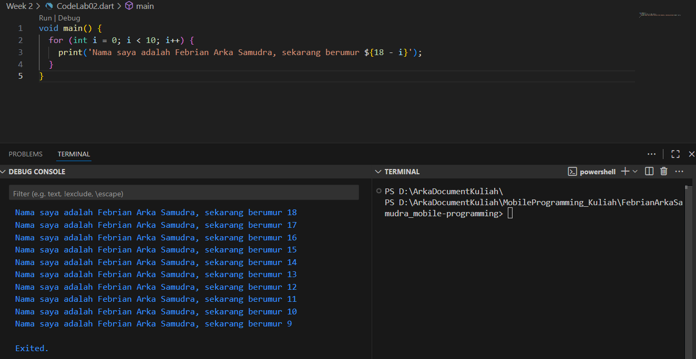
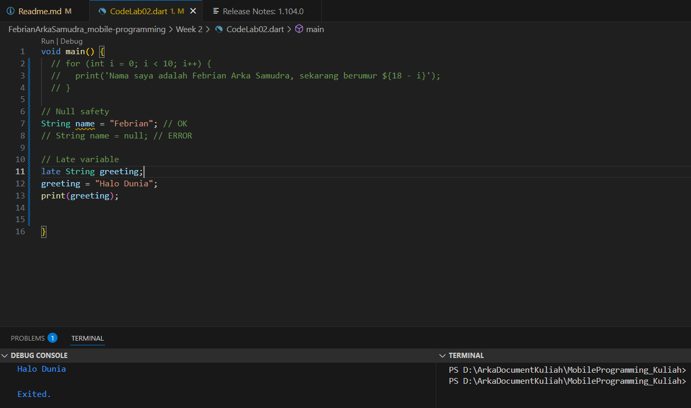

== Soal 1 ==

== Soal 2 ==

Mengapa penting memahami Dart sebelum menggunakan Flutter?

Karena Flutter adalah framework yang menggunakan bahasa Dart sebagai dasar logika dan strukturnya. Tanpa memahami Dart, kita akan kesulitan dalam:
- Membuat logika aplikasi
- Mengelola state, variabel, dan fungsi
- Menyusun struktur file, class, dan widget
- Memahami Dart membuat kita lebih cepat beradaptasi dan efisien saat membangun aplikasi Flutter.

== Soal 3 ==

Poin Penting dari Codelab Ini:

- Mengenal struktur dasar program Dart (main(), print(), for)
- Pemahaman tentang tipe data dan variabel
- Penggunaan perulangan (for loop)
- Penulisan string dengan interpolasi (${})
- Pentingnya penamaan yang jelas dan rapi
- Persiapan dasar untuk belajar widget dan state di Flutter

== Soal 4 ==

Perbedaan null safety dan late variable di Dart:

null safety :
- Fitur Dart yang memastikan variabel tidak bisa bernilai null secara default, untuk mencegah error saat runtime.

late :
- Digunakan untuk memberitahu Dart bahwa variabel akan diinisialisasi nanti (late), tapi tetap dijamin tidak null.