 # *Praktikum 1: Eksperimen Tipe Data List*
## **Step 1**
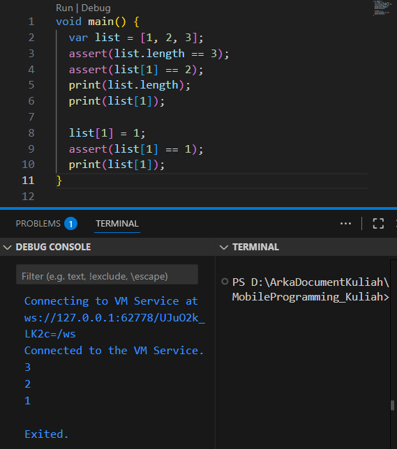

### **Explanation :**
#### Result:
In this example, a list with three elements [1, 2, 3] is created. To verify its correctness, we check that the list has a length of 3 and that the value at index 1 is 2. When printed, both conditions are confirmed. We then update the element at index 1 from 2 to 1, and after printing again, we confirm the change. This illustrates that lists in Dart support accessing and updating elements by their index.

## **Step 2**
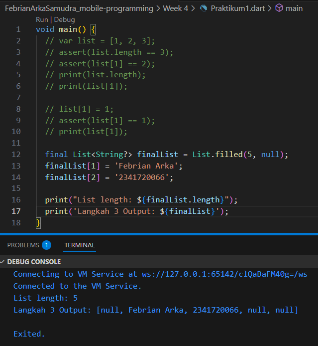

### **Explanation :**
#### Result:
In this example, a list is declared using final List<String?>, meaning the list reference cannot be reassigned. Using List.filled(5, null), we initialize it with five elements, all initially set to null. The String? type allows each element to store either a string or null. We then assign "Baskoro Seno Aji" to index 1 and "2341720063" to index 2. Even though the list is marked as final, its individual elements can still be updated. Since the data types are used correctly, the code runs without any errors.

# *Praktikum 2: Eksperimen Tipe Data Set*
## **Step 1**
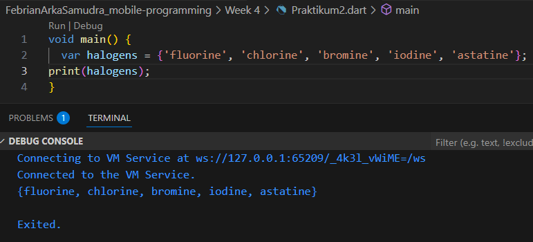

### **Explanation :**
#### Result:
The provided code is valid and executes without errors within the main() function. It defines a Set containing five halogen element names. In Dart, a Set is a collection that automatically removes duplicates and does not maintain any specific order of elements. When print(halogens) is called, it displays all the elements, but the order may differ each time due to the unordered nature of sets.

## **Step 3**
### **Run But No Output**
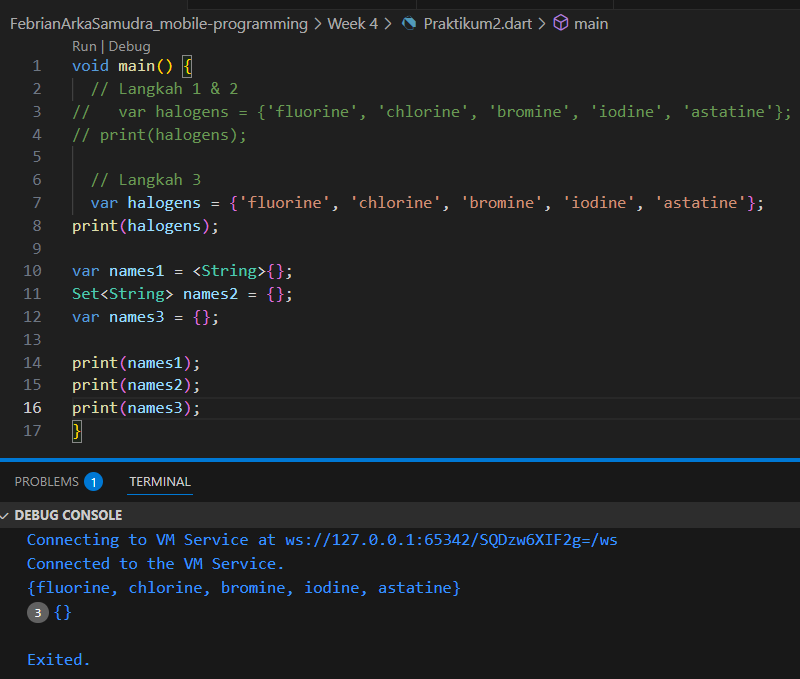
### **Two Way Declaring**
.png)
.png)

### **Explanation :**
#### Result:
This example demonstrates various ways to declare and use Set and Map in Dart. The variable names1 is declared as var names1 = <String>{};, explicitly defining a set of type String using a set literal. Likewise, names2 is written as Set<String> names2 = {};, which uses an explicit type with an implicit constructor. However, if we write var names3 = {};, Dart treats it as a Map by default, since empty curly braces without a type are interpreted as a Map. For sets, we can use .add() to insert a single element or .addAll() to add multiple items. In contrast, Map objects like names3 store data as key–value pairs, and elements are added using keys because Map does not support the .add() method. The code runs without errors because all declarations and method usages are syntactically and semantically correct for their respective types.

# *Praktikum 3: Eksperimen Tipe Data Maps*
## **Step 1**
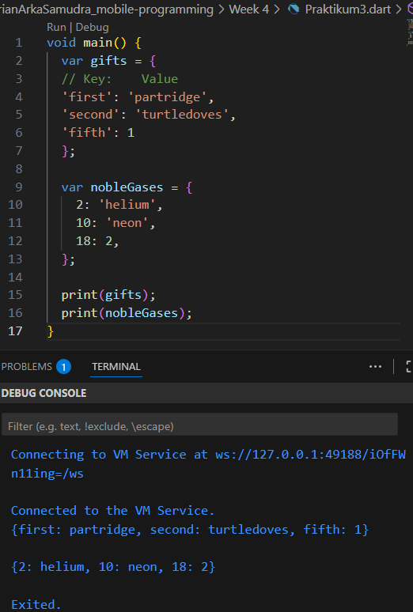

### **Explanation :**
#### Result:
In this example, two Map objects are defined, each using a different key type. The first map, gifts, uses String keys and contains a mix of String and int values. The second map, nobleGases, uses int keys and also includes values of different types. Dart allows Map values to have varying data types, so combining String and int values in the same map is valid. Because the syntax is correct and Dart supports this kind of flexibility, the code executes without any errors.

## **Step 3**
### **Original Code**
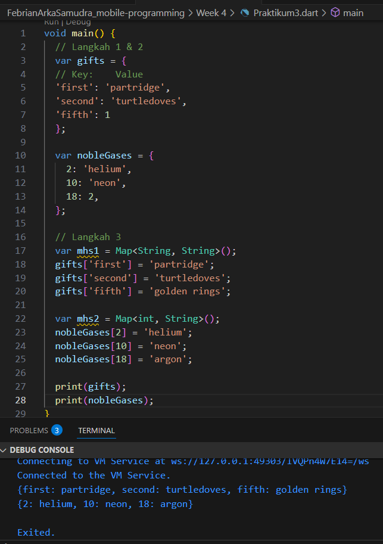
### **Additional Requirements**
.png)
.png)

### **Explanation :**
#### Result:
This example shows different ways to declare Map variables in Dart. When using var gifts = {...} or var nobleGases = {...}, Dart creates a map of type _LinkedHashMap<dynamic, dynamic>, meaning both keys and values can be of any type. On the other hand, explicitly declaring var mhs1 = Map<String, String>() results in a _LinkedHashMap<String, String>, where both keys and values must be String. Similarly, var mhs2 = Map<int, String>() creates a map with int keys and String values. All versions of the code work without errors. As part of the updates, the value of nobleGases[18] was changed from 2 to 'argon', and gifts['fifth'] was changed from 1 to 'golden rings'. Additionally, the student’s name and ID were added to all maps, ensuring each one followed its defined type rules.

# *Praktikum 4: Eksperimen Tipe Data List: Spread dan Control-flow Operators*
## **Step 1**
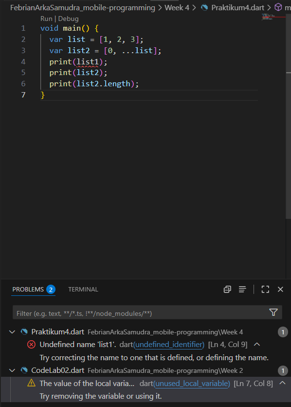

### **Explanation :**
#### Result:
The error occurred because list1 was not defined or did not have any assigned value, so there was nothing to print or store.

## **Step 2**
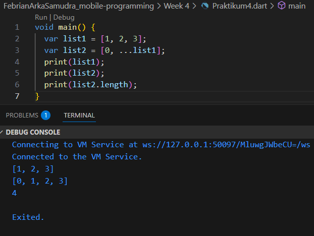

### **Explanation :**
#### Result:
Correct the reference by defining list1 properly and updating the code to use list1 instead of List, so the output can be generated using the correct variable reference. 

## **Step 3**
### **Error Original Code**
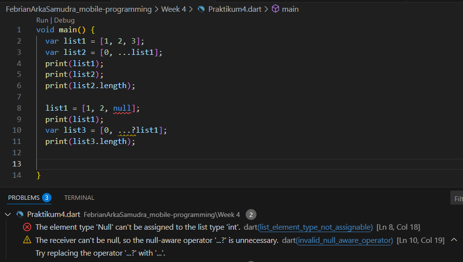
### **Fix and Adding NIM Spread Operator**
.png)
.png)

### **Explanation :**
#### Result:
This example uses the null-aware spread operator (...?) to safely include elements from a list that could be null. If list1 is null, the operator prevents any errors and simply adds nothing to the new list. This approach enhances code safety by avoiding runtime exceptions when dealing with potentially null lists. However, it's important to remember that even with this operator, individual elements within the list can still be null—as long as the list's type allows it.

## **Step 4**
### **Error Original Code**
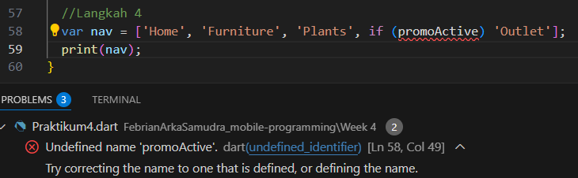
### **Fix and PromoActive**
.png)
.png)

### **Explanation :**
#### Result:
This example showcases Dart's collection if feature. The expression if (promoActive) 'Outlet' adds the string 'Outlet' to a list only when the boolean variable promoActive is true. If promoActive is false, the item is simply skipped without causing any errors. This feature allows developers to build lists dynamically based on conditions, making the code cleaner and more expressive than manually adding items later. In the example, when promoActive is true, the list nav becomes ['Home', 'Furniture', 'Plants', 'Outlet']. If it's false, 'Outlet' is excluded, and nav becomes ['Home', 'Furniture', 'Plants']. This demonstrates how Dart supports conditional logic directly within list literals.

## **Step 5**
### **Error Original Code**
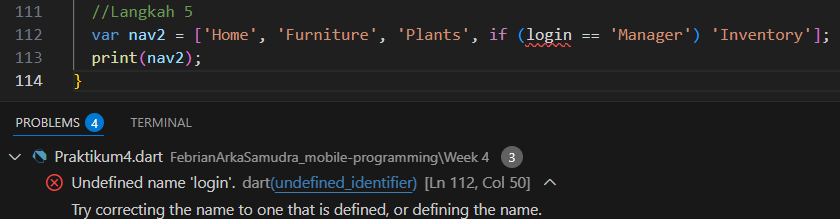
### **Fix and PromoActive**
.png)
.png)

### **Explanation :**
#### Result:
This example demonstrates Dart’s use of pattern matching within a collection using the expression if (login case 'Manager'). It checks if the variable login matches the value 'Manager'. If it does, the string 'Inventory' is added to the list; if not, it's skipped. This enables building lists conditionally based on more precise value matching rather than just simple boolean conditions. In the program, if login equals 'Manager', the resulting list nav2 becomes ['Home', 'Furniture', 'Plants', 'Inventory']. If login is 'Employee' or 'Guest', 'Inventory' is left out, and the list is ['Home', 'Furniture', 'Plants']. This shows how Dart integrates pattern matching with collection literals to create flexible and concise dynamic lists.

## **Step 6**
### **Original Code**
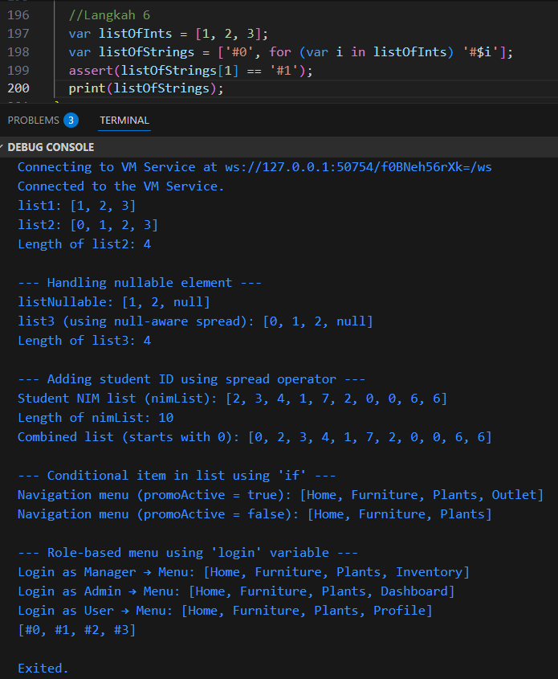

### **Explanation :**
#### Result:
This example illustrates Dart’s collection for feature. The expression for (var i in listOfInts) '#$i' loops through each element in listOfInts and creates a new string in the format '#<value>'. For example, if listOfInts is [1, 2, 3], the resulting list will be ['#0', '#1', '#2', '#3'], where '#0' is manually added before the loop, and the rest are generated through iteration. This feature is especially useful for transforming or mapping existing lists directly within a collection literal, making the code more concise and readable.

In summary, Dart collection features offer:

- Spread Operator (...): Easily combines lists or adds extra elements to a copied list.

- Null-aware Spread Operator (...?): Avoids runtime errors when spreading a potentially null list, improving code safety.

- Collection if: Dynamically includes elements based on conditions, reducing the need for separate control structures.

- Collection for: Enables direct transformation of existing lists into new forms within a list literal.

Together, these features make Dart collections highly flexible, expressive, and ideal for writing clean, dynamic, and safe code.

# *Praktikum 5: Eksperimen Tipe Data Records*
## **Step 1**
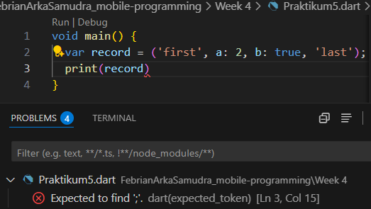

### **Explanation :**
#### Result:
The error occurred because a semicolon (;) was missing at the end of the last line, which is required to properly terminate the statement in Dart.

## **Step 2**
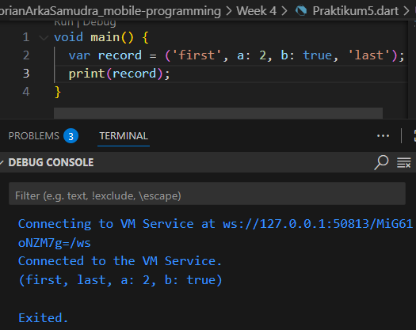

### **Explanation :**
#### Result:
This example showcases Dart’s record type. The declaration ('first', a: 2, b: true, 'last') defines a record with four fields: two positional ('first' and 'last') and two named (a: 2 and b: true). Records are lightweight and immutable data structures that let developers group related values without creating a full class. When printed, the record displays all its fields in the order they were defined. This makes records particularly useful for returning multiple values from a function or managing structured data in a compact and readable way.

## **Step 3**
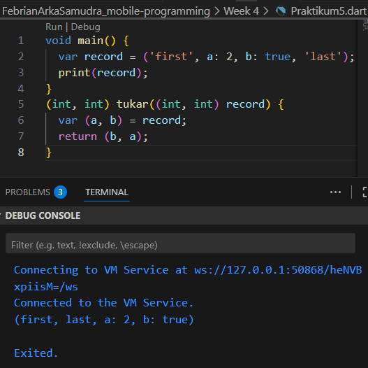

### **Explanation :**
#### Result:
This example illustrates how the tukar() function uses Dart records with destructuring and value manipulation. The function is defined as (int, int) tukar((int, int) record), which means it takes a record with two integers and returns another record of the same type. Inside the function, var (a, b) = record; unpacks the record into two separate variables, a and b. The function then returns a new record with the values swapped using return (b, a);. For instance, if the input is (5, 10), the output will be (10, 5). This demonstrates that Dart records not only allow grouping values but also enable easy manipulation using pattern matching and destructuring.
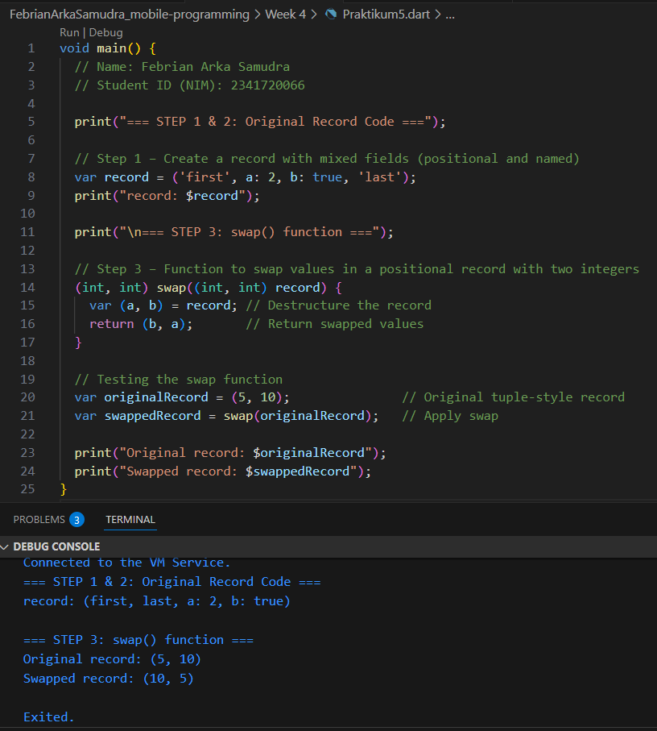

## **Step 4**
### **Error Original Code**
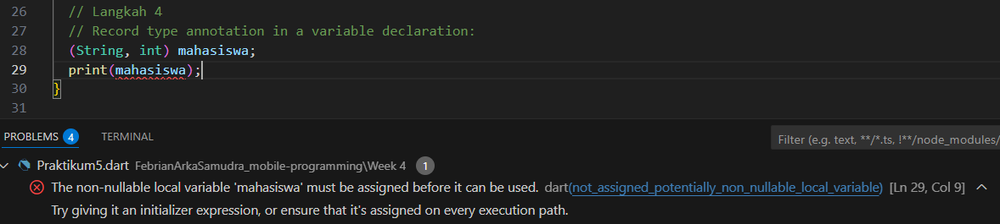
### **Fix and Initialization for Mahasiswa Using Name and NIM**
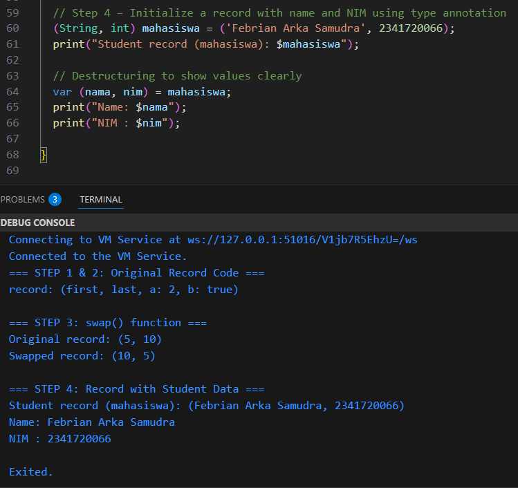

### **Explanation :**
#### Result:
In this step, a record is created using an explicit type annotation. The variable mahasiswa is declared as (String, int), indicating that it contains two fields: a String and an int. It is initialized with the values ('Baskoro Seno Aji', 2341720063). Using type annotations helps the compiler enforce strict type checking, ensuring that only values with the correct types are assigned. To access the fields, Dart uses $1 for the first field (the student’s name) and $2 for the second (the student’s ID). Unlike lists or arrays, record fields in Dart start indexing from $1, not $0.

## **Step 5**
### **Original Code**
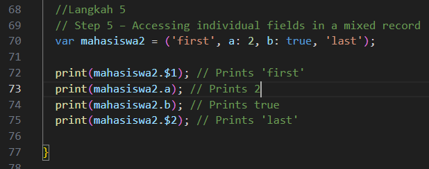
.png)
### **Additional Requirements using Record**
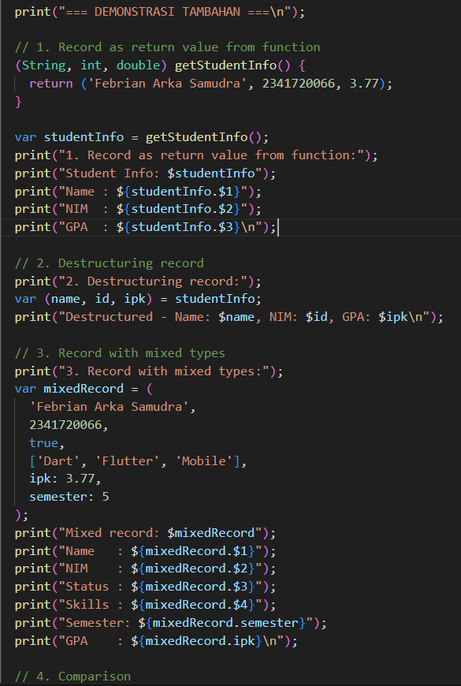
.png)

### **Explanation :**
#### Result:
In Dart, records can include a mix of positional and named fields. Positional fields are accessed using $1, $2, $3, etc., while named fields are accessed using their identifiers like .a, .b, or .semester. This flexibility makes records a powerful tool for grouping related data. One key benefit of records is that they allow functions to return multiple values without needing to define a custom class. Dart enforces type safety, ensuring each field matches its declared type at compile time. Records also support destructuring, enabling you to extract values into variables in a clear and concise way. Since records are immutable by default, their values cannot be changed once assigned, making them safer for managing data. For simple structured data, they are also more efficient than defining a new class. In short, records offer a lightweight and expressive solution for handling grouped data in Dart.

# *Tugas Praktikum*
## **02.Jelaskan yang dimaksud Functions dalam bahasa Dart!**
A function is a reusable block of code that performs a specific task. It can be called multiple times throughout a program, making the code more organized, easier to read, and simpler to maintain.

## **03.Jelaskan jenis-jenis parameter di Functions beserta contoh sintaksnya!**
**1. Positional Parameters**

Definition: Parameters that are provided in a specific, fixed sequence.
Behavior: Arguments must be passed in the exact order they are defined in the function.
Use Case: Ideal for required values where the order makes logical sense, such as dimensions like width and height.

**2. Optional Positional Parameters ([])**

Definition: Parameters enclosed in square brackets that are optional and can be omitted when calling the function.
Behavior: If not provided, they default to null unless a default value is explicitly assigned.
Use Case: Suitable when certain arguments are not always necessary, offering flexibility in function calls.

**3. Named Parameters ({})**

Definition: Parameters provided by name, enclosed in curly braces within the function definition.
Behavior: Callers must use the parameter names when passing values. Named parameters are optional by default, unless marked required.
Use Case: Enhances code clarity and is especially useful when dealing with functions that take many parameters or parameters with similar types.

**4. Default Parameters**

Definition: Named or optional parameters can be assigned default values directly in the function declaration.
Behavior: When no argument is provided, the default value is automatically used.
Use Case: Useful for preventing null values and reducing the need for manual null checks, ensuring parameters always have a valid value.

## **04.Jelaskan maksud Functions sebagai first-class objects beserta contoh sintaknya!**\

In Dart, functions are first-class objects, which means they can:

- Be assigned to variables

- Be passed as arguments to other functions

- Be returned from functions

This allows for flexible and functional programming patterns.

## **05.Apa itu Anonymous Functions? Jelaskan dan berikan contohnya!**\

Anonymous functions are functions that don’t have a name. They are typically used inline, often passed as arguments to other functions or used in expressions where a named function isn’t necessary.

## **06.Jelaskan perbedaan Lexical scope dan Lexical closures! Berikan contohnya!**\
**A. Lexical Scope**

- Definition: Lexical scope means a variable’s visibility is based on where it is defined in the source code, not where the function is called.

- Explanation: Dart uses static (lexical) scoping, meaning a function can access variables declared in its own scope or in any enclosing scope, but not in inner or unrelated scopes.

**B. Lexical Closures**

- Definition: A closure is a function that retains access to variables from its surrounding lexical scope, even after the outer function has completed execution.

- Explanation: This means the closure "remembers" the environment in which it was created and can continue to use those variables later.

## **07.Jelaskan dengan contoh cara membuat return multiple value di Functions!**\
Dart doesn't natively support returning multiple values as some other languages do, but it offers several effective workarounds:

- List: Return multiple values as a list.

- Record: Use Dart’s record type to return a fixed set of typed values.

- Map: Return a map with key-value pairs.

- Class: Create a custom class to group and return related values.

Each approach has its use case depending on readability, type safety, and structure needed.

**1. Using a List**

- Explanation: Store all return values in a List and return the list from the function.

- Limitation: Values must be accessed by index (e.g., result[0]), which can reduce code clarity and increase the chance of mistakes.

**2. Using a Map**

- Explanation: Return multiple values using a Map with key–value pairs to label each result.

- Advantage: Improves readability over lists by allowing access through descriptive keys instead of numeric indexes.

**3. Using a Class (Custom Object)**

- Explanation: Define a custom class to encapsulate and return multiple related values.

- Advantage: Ideal for complex data structures; provides strong type safety, better organization, and clearer intent.

**4. Using Records (Dart 3+)**

- Explanation: Use Dart's record type to return multiple values with specific types, without needing to define a class.

- Advantage: Clean syntax, supports strong typing, and allows destructuring for easy access to individual values.