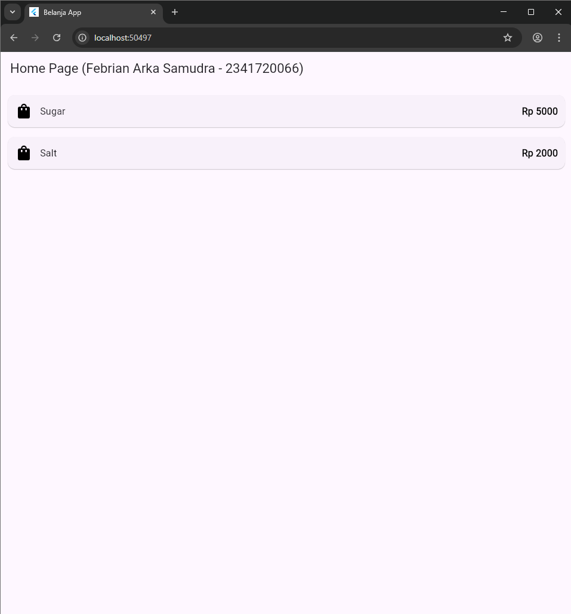
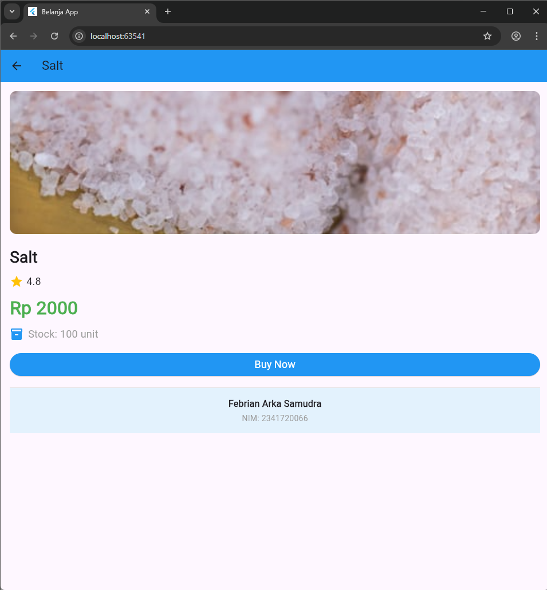
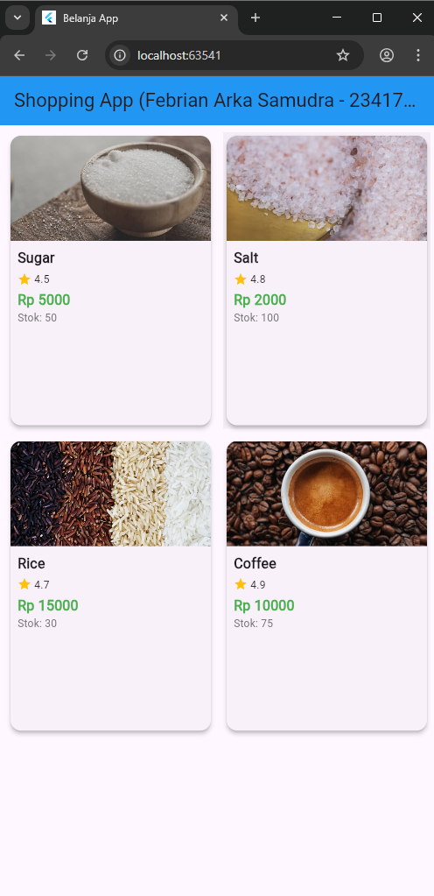

# *belanja*

## *Flutter Navigation - Belanja App*
Praktikum 5: Membangun Navigasi di Flutter
This project demonstrates Flutter navigation and routing mechanisms through a simple shopping list application. The app shows how to navigate between pages and pass data between screens.

# *Home Page - Shopping List*

The Home Page displays a shopping list using ListView with two sample items: Sugar (Rp 5000) and Salt (Rp 2000). Each item is displayed in a Card widget with a shopping bag icon on the left and the price aligned to the right. The list items are tappable using InkWell widget, which provides a material ripple effect when pressed and navigates to the Item Page with the selected item's data.

Features Implemented

- Navigation & Routing: Implementation of named routes for navigation between pages
- Data Model: Item model class to structure shopping list data
- ListView Builder: Dynamic list generation from data model
- Data Passing: Sending item data from Home Page to Item Page
- Material Design: Use of Card and InkWell widgets for better UX

# Tugas Praktikum 2  
**Pemrograman Mobile - Navigasi dan Rute (Flutter + go_router)**  

---

## Tujuan Praktikum

Praktikum ini bertujuan untuk memahami dan menerapkan konsep navigasi antar halaman pada aplikasi Flutter menggunakan plugin `go_router`, mengirimkan data antar halaman, serta menampilkan data produk secara menarik menggunakan `GridView` dan `Hero` animation.

---

## Fitur yang Diimplementasikan

- Navigasi antar halaman menggunakan `go_router`
- Pengiriman data menggunakan `extra` pada GoRoute
- Penambahan atribut produk:  
  **Gambar**, **Rating**, **Stok**
- Tampilan produk dalam format `GridView`
- Hero animation saat transisi ke halaman detail
- Footer identitas dengan nama dan NIM

---

## Result Implementasi 

