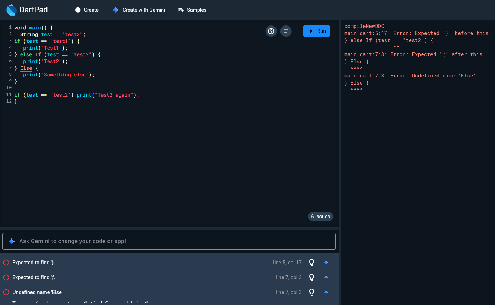
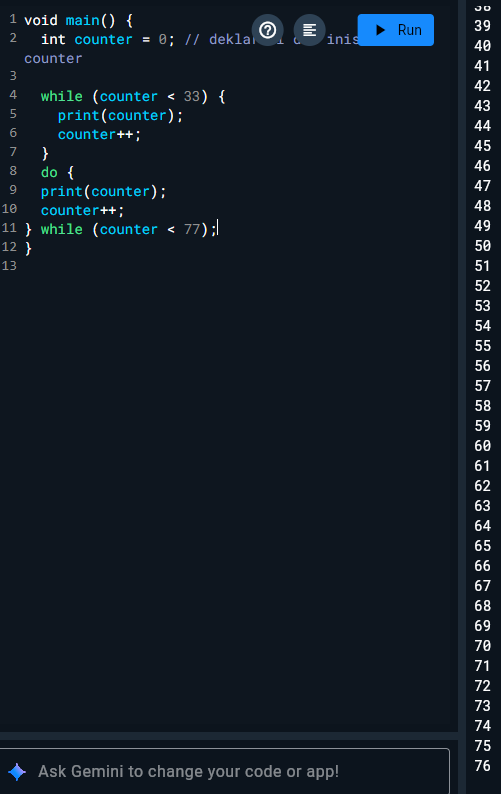
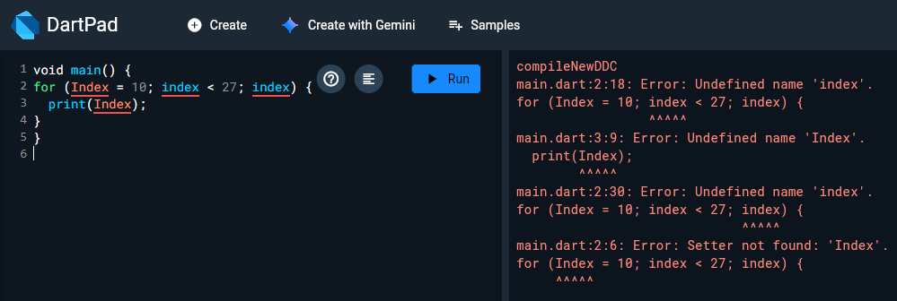
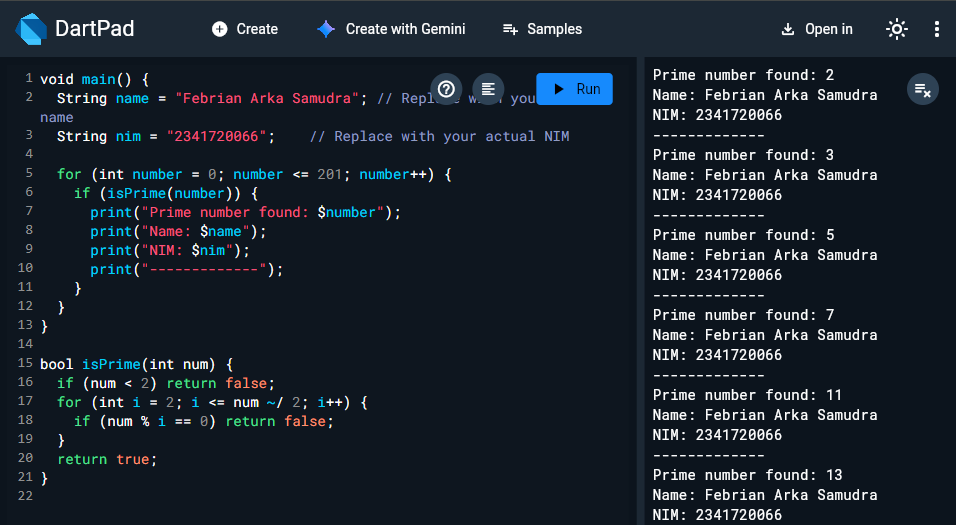

# Praktikum 1: Menerapkan Control Flows ("if/else")

## Langkah 1 & 2:

**Result :** 
Incorrect Capitalization of Keywords
The keywords if and else must be written in lowercase. Dart is case-sensitive, so using If or Else will result in a syntax error.

Using a String as a Boolean Condition
A String value like "true" cannot be directly used in an if statement. Dart requires a Boolean (true or false) in conditionals. Comparing the string explicitly is necessary.

Duplicate Variable Declaration
Declaring two variables with the same name (test) in the same scope is not allowed. Variable names must be unique within their scope to avoid conflicts and compile-time errors.

# Praktikum 2: Menerapkan Perulangan "while" dan "do-while"

## Langkah 1 & 2:

The program produces an error because the variable used in the while loop condition (counter) has not been declared or initialized before it is used. In Dart, all variables must be declared with a specific type or using var before they are accessed. Attempting to use an undefined variable will result in a compile-time error.

**Result :** 
.png)

The program is designed to display numbers starting from 0 up to 32 using a while loop.

Before the loop starts, a variable is created to act as a counter, and it's initialized with the value 0.

The while loop continues to run as long as the counter is less than 33. Inside the loop, the current value of the counter is printed to the screen. After printing, the counter is increased by 1.

This process repeats: print → increase → check condition again. Once the counter reaches 33, the condition becomes false, and the loop stops.

## Langkah 3:

**Result :** 
The program starts by creating a variable initialized to zero.

It enters a while loop that continues as long as the variable is less than 33. During this loop, it prints the current value and increases it by one each time. As a result, it prints the numbers from 0 up to 32.

After the while loop finishes, the program enters a do-while loop. This type of loop always executes at least once, even if the condition is false after the first run.

In the do-while loop, it again prints the current value of the variable and increases it by one, continuing until the value reaches 77.

# Praktikum 3: Menerapkan Perulangan "for" dan "break-continue"

## Langkah 1 & 2:

Variable Index is not declared
Dart requires all variables to be declared before use. Index has no type and hasn't been declared.

Inconsistent casing
Dart is case-sensitive. Index (with capital "I") and index (with lowercase "i") are treated as two different variables, which leads to confusion and errors.

Missing increment expression in the loop
In the for loop, there's no increment step (like index++). Without it, the loop will run infinitely or not function as expected.

**Result :** 
.png)

Variable Declaration:
int index = 10; declares a loop variable starting at 10.

Condition:
The loop continues running as long as index is less than 27.

Increment:
index++ increases the value by 1 after each loop iteration.

Loop Body:
print(index); prints the current value of index to the console.

## Langkah 3:

Incorrect keyword casing: If and Else If
Dart is case-sensitive. The correct keywords are if and else if — all lowercase. Using uppercase like If or Else If causes a syntax error.

Inconsistent variable name: Index vs index
Dart treats Index and index as two completely different variables. You declared index, but then referred to it as Index, which is undefined.

Incorrect logic: if (index > 1 || index < 7)
This condition is always true for any number because every number is either greater than 1 or less than 7. For example, 10 is greater than 1, so the condition is always met. This causes the continue statement to skip most values unexpectedly.

**Result :**
.png) 

The for loop starts from 10 and goes up to (but not including) 27.

If the value of index reaches 21, the loop stops immediately because of the break statement.

If the index is outside the range 13 to 25, the continue statement skips that iteration and does not execute print().

Only values between 13 and 20 will be printed, because once it hits 21, the loop breaks.

# Tugas Praktikum: 
Buatlah sebuah program yang dapat menampilkan bilangan prima dari angka 0 sampai 201 menggunakan Dart. Ketika bilangan prima ditemukan, maka tampilkan nama lengkap dan NIM Anda.
---
**#Result:**

.png)

The program prints all prime numbers from 0 to 201. For each prime number found, it also displays your full name and student ID (NIM).

It works by:

Looping through numbers from 0 to 201.

Checking if each number is prime (a number greater than 1 with no divisors other than 1 and itself).

Printing the prime number, your name, and your NIM when a prime is found.

The result is a list of all prime numbers within the range, along with your personal information shown for each.